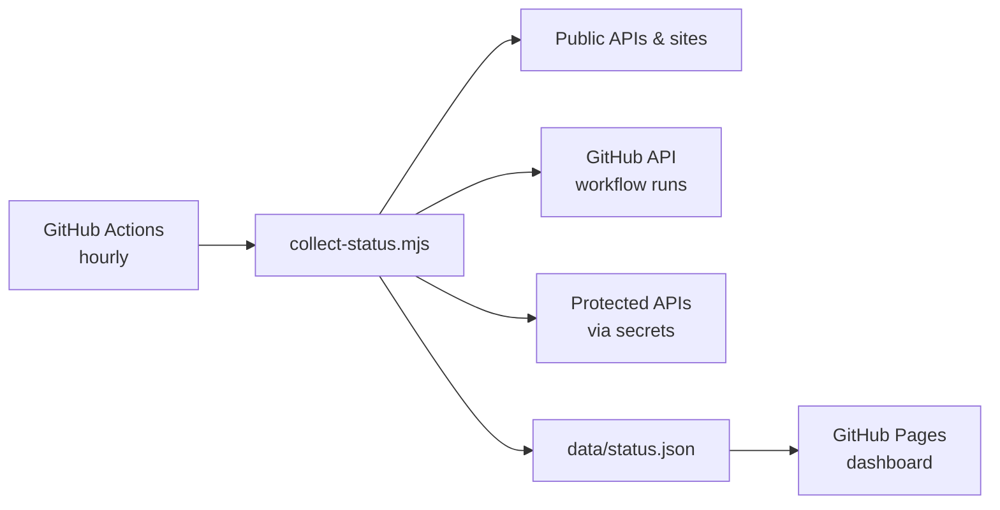

# E-GEEK Mission Control

Read-only status dashboard for **E-GEEK Creations** automations — APIs, PWAs, GitHub Actions workflows, and protected endpoints.

**Live dashboard:** https://sgeorge83.github.io/e-geek-mission-control-MVP/

---

## What it shows

| Category | Examples |
|----------|----------|
| **E-GEEK APIs** | Bible Widget backend, Urdu Bible API |
| **E-GEEK Sites** | Daily Bread PWA, VOTD Urdu/English PWA |
| **Social Automation** | VOTD-IG daily Instagram/Facebook post |
| **Deployments** | GitHub Pages deploy workflows |
| **Mobile Builds** | Bible Widget, Bible Themes, PinkNubes APK |
| **HR Automation** | LEAD-ENGINE |
| **Protected APIs** | Bible cron refresh (optional, needs secret) |

Status is collected **server-side** by GitHub Actions and written to `data/status.json`. The public dashboard only reads that file — **no secrets in the browser**.

---

## How it works



1. **Collect Status** workflow runs every hour (and on push to `main`).
2. Script pings all configured endpoints and fetches last workflow run per repo.
3. Results are committed to `data/status.json`.
4. **Deploy GitHub Pages** workflow publishes the static dashboard.

---

## One-time GitHub setup

### 1. Enable GitHub Pages (one-time, ~30 seconds)

Repo → **Settings → Pages** → **Build and deployment**:

- **Source:** Deploy from a branch
- **Branch:** `gh-pages` → `/ (root)` → **Save**

The deploy workflow already publishes to `gh-pages` and collects fresh status on every push. After enabling Pages, the live URL is:

**https://sgeorge83.github.io/e-geek-mission-control-MVP/**

### 2. Add secrets (recommended)

| Secret | Purpose |
|--------|---------|
| `GH_STATUS_TOKEN` | Fine-grained PAT with **Actions: Read** on monitored repos (needed for **private** repo workflow status) |
| `BIBLE_CRON_SECRET` | Optional — monitors `/api/cron/refresh-votd` on bible-widget-backend |

**GH_STATUS_TOKEN setup:**

1. [GitHub → Settings → Developer settings → Fine-grained tokens](https://github.com/settings/tokens?type=beta)
2. Repository access: select all E-GEEK repos you want monitored (or all repositories)
3. Permissions: **Actions → Read-only**, **Metadata → Read**
4. Add as repo secret `GH_STATUS_TOKEN` in **e-geek-mission-control-MVP**

Public repos work without the token for workflow status. Private repos show **unknown** until the token is set.

### 3. Trigger first status collect

**Actions → Collect Status → Run workflow**

After it completes, refresh the dashboard.

---

## Add or remove monitored services

Edit [`config/services.json`](config/services.json):

- `apis` — public JSON/RSS endpoints
- `sites` — static site URLs
- `workflows` — GitHub Actions workflows (`owner/repo` + workflow filename)
- `optionalApis` — endpoints that need a Bearer token from secrets

Then push to `main`. The collector runs automatically.

---

## Local development

```powershell
cd C:\Users\SharoonGeorge\Projects\e-geek-mission-control
node scripts/collect-status.mjs
# Optional: set GH_STATUS_TOKEN for private repo checks
$env:GH_STATUS_TOKEN = "github_pat_..."
node scripts/collect-status.mjs
```

Open `index.html` via a local server (or push to GitHub Pages):

```powershell
npx serve .
```

---

## Project layout

| Path | Purpose |
|------|---------|
| `index.html`, `styles.css`, `app.js` | Dashboard UI |
| `data/status.json` | Generated status (updated by Actions) |
| `config/services.json` | What to monitor |
| `scripts/collect-status.mjs` | Status collector |
| `.github/workflows/collect-status.yml` | Hourly status + commit |
| `.github/workflows/pages.yml` | GitHub Pages deploy |

---

## License

MIT — see [LICENSE](LICENSE).

Developed by [Sharoon George / E-GEEK Creations](https://github.com/sgeorge83).
